= Compte-rendu DM-CSS
:toc:

== Sommaire

Réalisé par :

- CHONG TOUA Joshua

Date début : 06/10

== Contexte

Devoir maison, reconstruire une page html/css.

== Introduction
Pour démarrer le projet, j'ai séparé la page en plusieurs partie, le header, la navbar, les éléments qui seront au centre de la page, le aside puis le footer.

== Header

Le header est la premiere chose que j'ai modifié.
Il contient l'image et la barre de recherche.

Code HTML :

image::/imgReadme/header/headerHtml.png[]

Code CSS : 

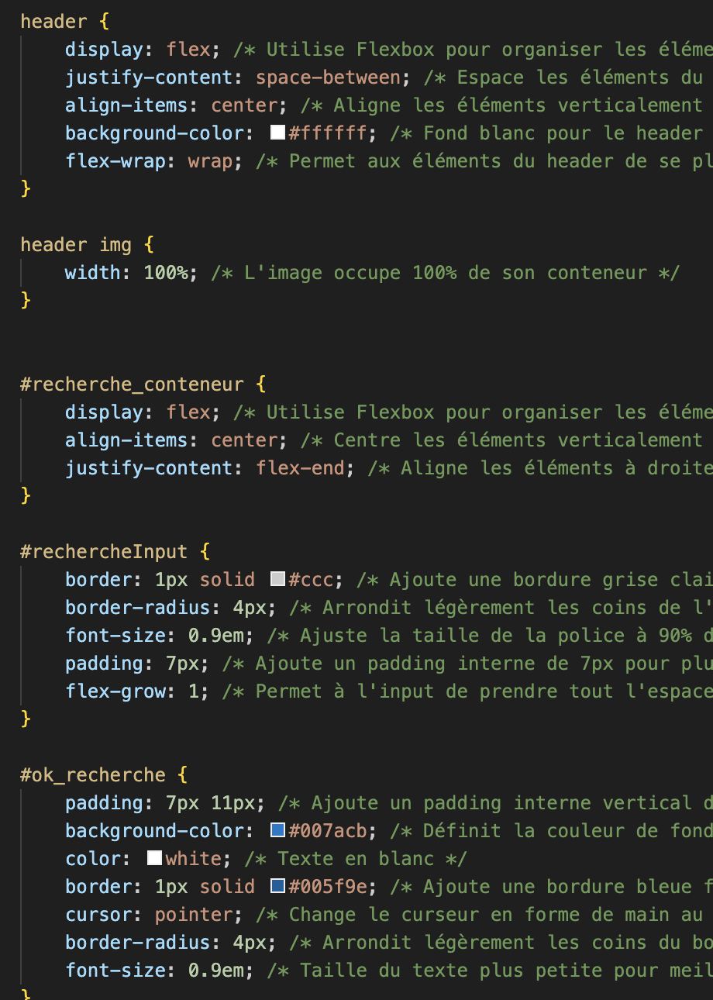

- Utilisation de flex pour une disposition flexible et responsive.

- Le justify-content: space-between permet de répartir les éléments, tandis que flex-wrap: wrap assure une bonne adaptation sur les petits écrans.

- L'image est définie pour prendre 100% de largeur, ce qui garantit qu'elle s'adapte aux dimensions de son conteneur.

- recherche_conteneur : Le conteneur de recherche est centré horizontalement à l'aide de flexbox. 

Rendu :

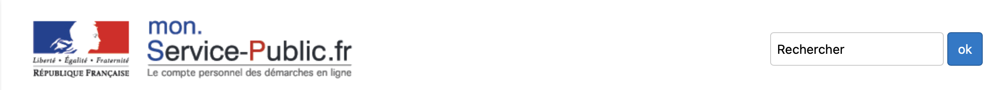

== NavBar

La navbar contient quatre boite qui lors du survol affiche des elements.

Code HTML :

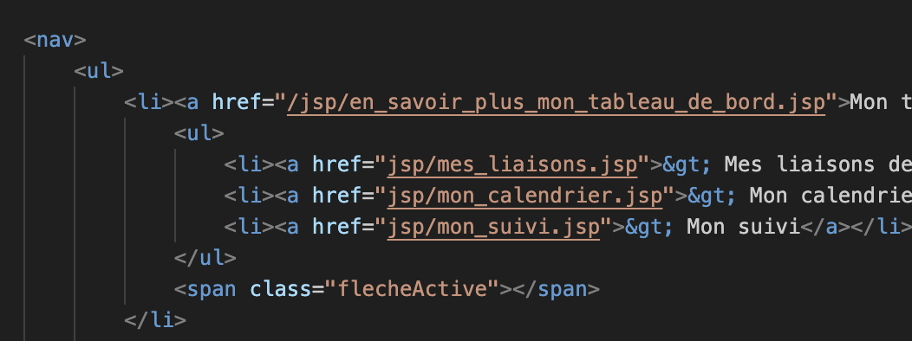

Fichier CSS :

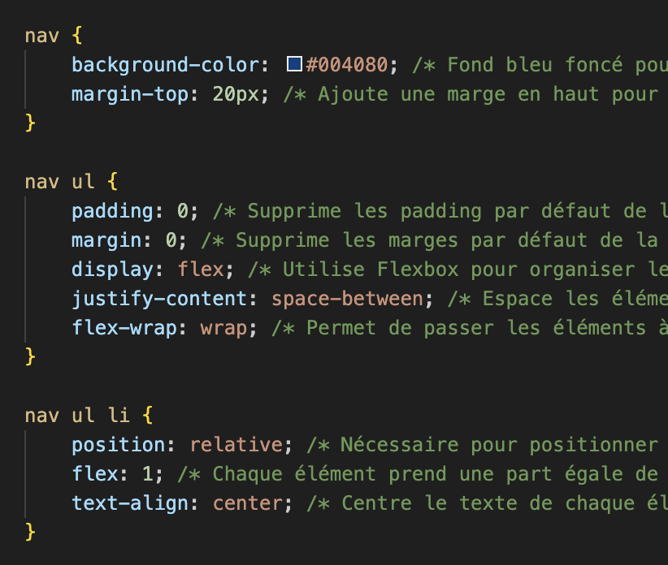

- Utilisation de flex pour une disposition flexible et responsive.

- Utilisation de flex-wrap pournl'adaptation sur les petit ecrans.

Le sous-menu de chaque élément est en display:none et lors d'un survol avec 
hover, le display devient display:bloc

Rendu :

Sous-menu ouvert : 

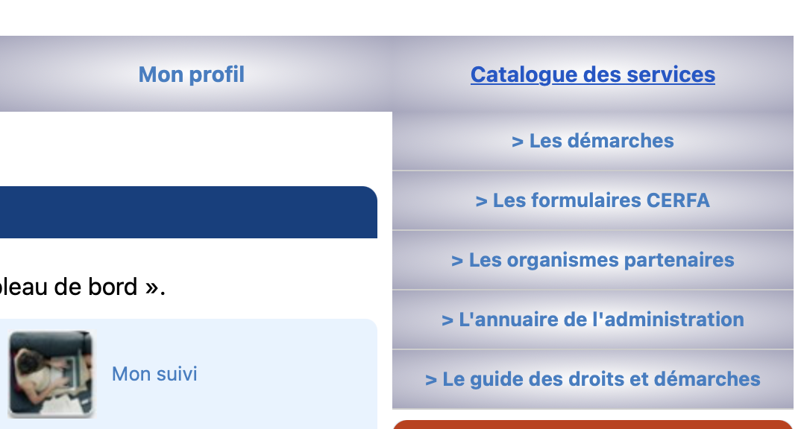.png[]

== Main

Dans l'élément principal on y retrouve 3 articles à l'interieur.

Code HTML :

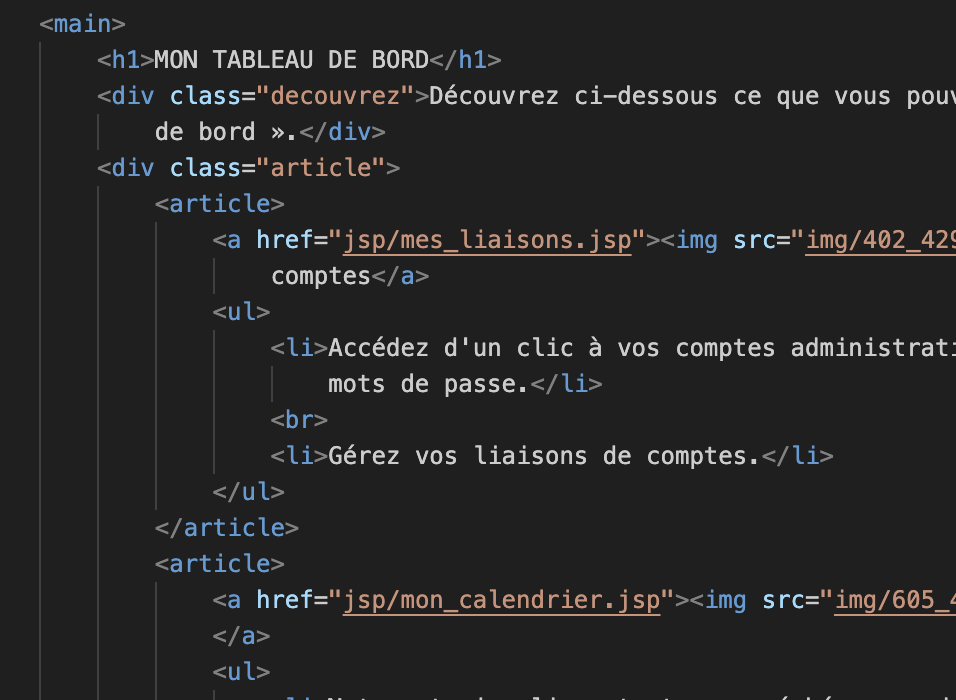

Code Css : 

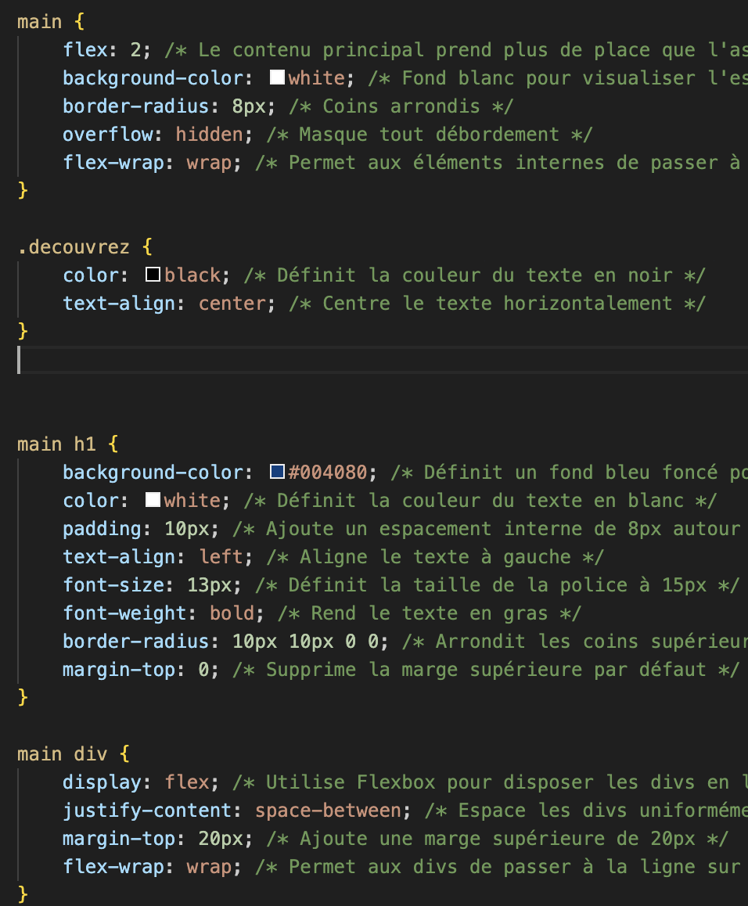

- Utilisation de flex pour une disposition flexible et responsive.
- Le flex: 2 permet à la section principale de prendre plus de place que l'aside. 
- Utilisation du padding pour l'espace.
- border-radius pour arrondir les bords.

Rendu : 

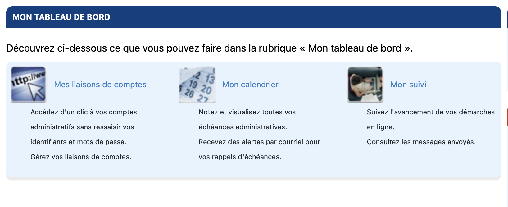

== Aside

Dans l'aside on y retrouve 2 articles.

Code Html : 

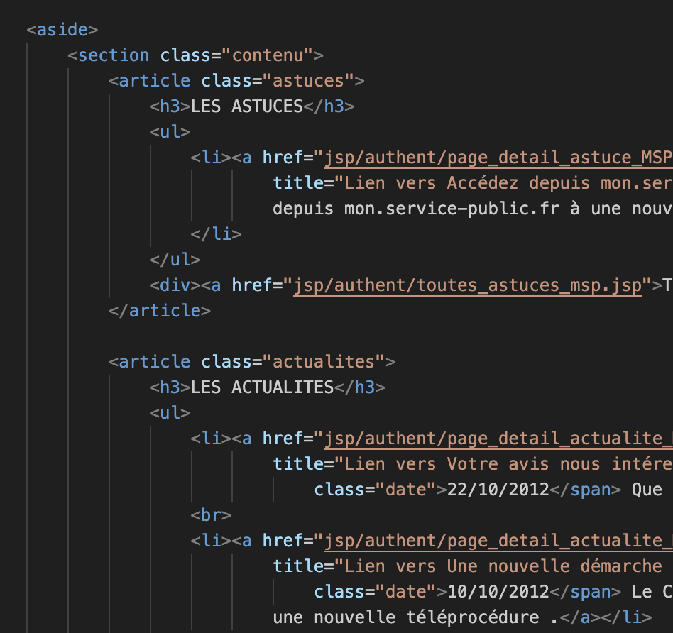

Code Css : 

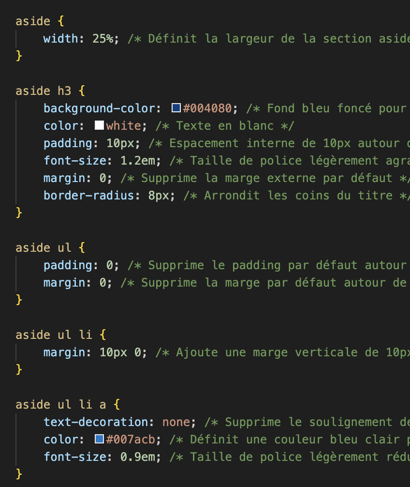

- Prend 25% de l'espace sur les grands écrans avec width: 25%.
- Padding pour l'espace interieur.

Rendu :

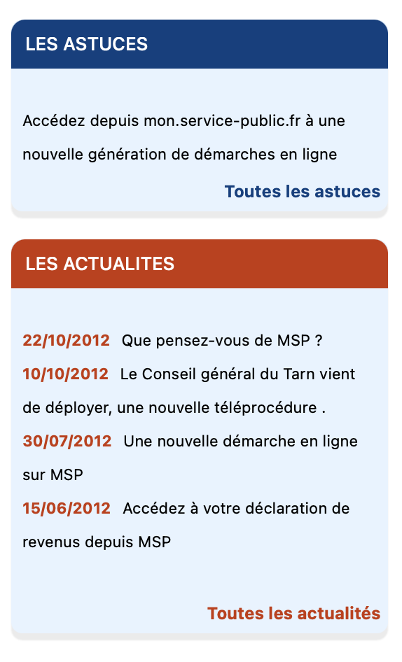

== Footer

Le footer se situe en bas de la page.

Il utilise la grille du framwork Bootstrap.

Code HTML :

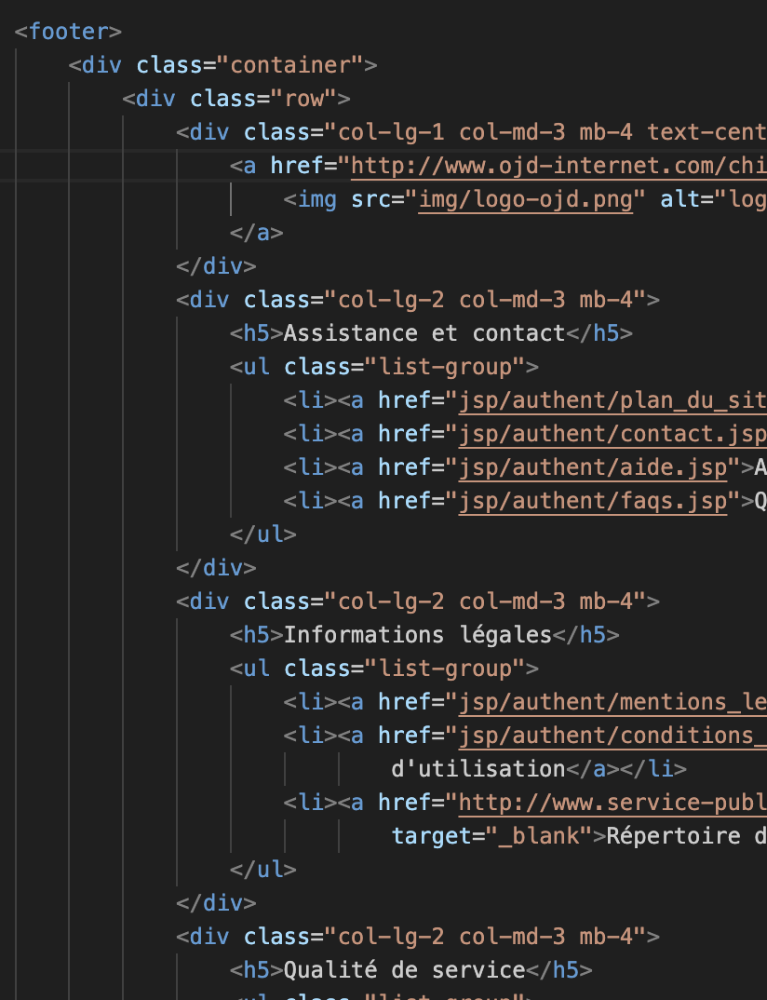

- Utilisation de col-lg-2 pour les grands écrans.
- Utilisation de col-md-3 pour les écrans moyens.
- Utilisation de mb-4 pour la marge sous l'élément.

Code CSS :

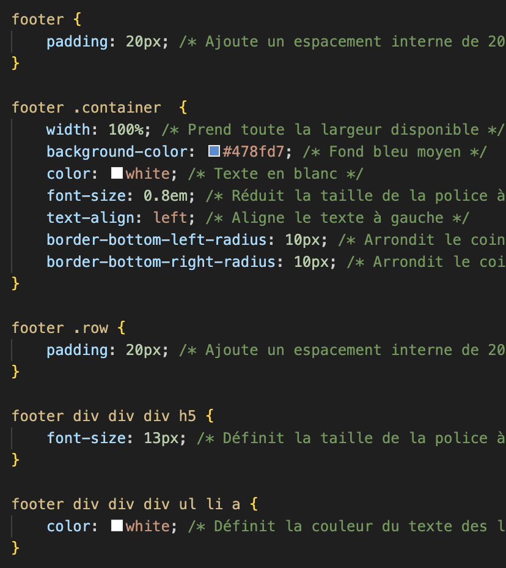

Rendu :

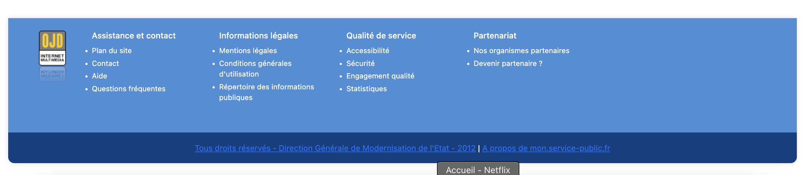

== Responsive sur petits ecrans

Code CSS : 

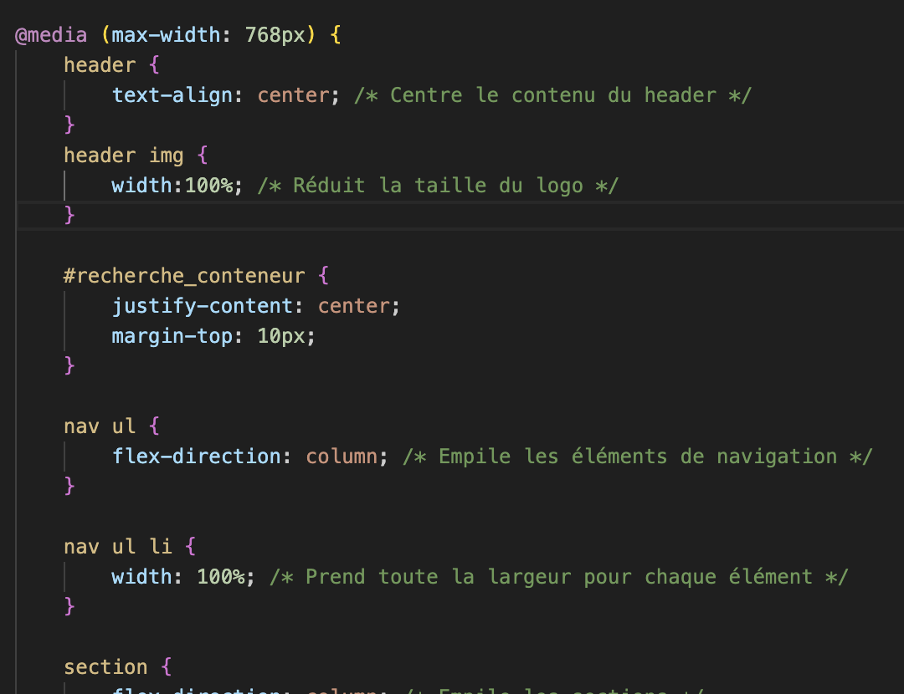

- Utilisation de @media (max-width: 768px) pour le format tablette.
- Ajout de certains parametres sur les balises global pour adapter l'affichage sur les petits écrans

Rendu :

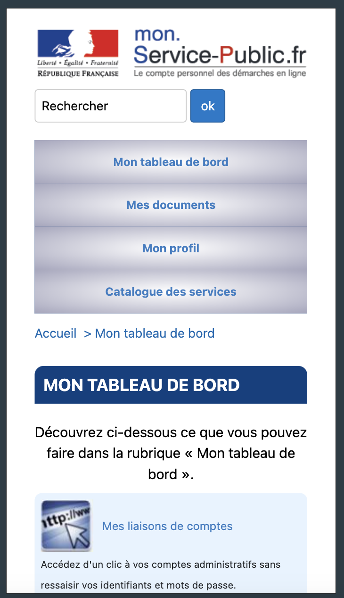

== Conclusion

Pour conclure, ce projet m'a apporté de nouvelles connaisances en CSS.

== Lien

Lien github: https://github.com/JoshuaChongToua/DM_CSS.git

Lien site : https://joshuachongtoua.github.io/DM_CSS/

